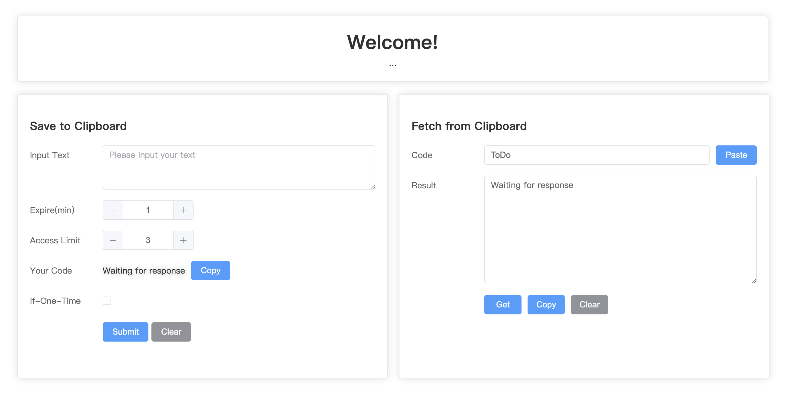

## DIY Clipboard

### Features
- Web GUI clipboard based on VUE3 & element-plus
- curl instruction supported API based on FastAPI
- once read once destroy


Preview:


### Quick Start

```bash
sh backend/start.sh
sh frontend/start.sh
```

### Details
#### How does it work
1. The user submits text (optional one-time parameter).
2. The backend generates a unique random code XXXX.
3. Code XXXX is used as a key to save the text in MongoDB.
4. Return the code to user for verification.
5. When the user retrieves the text with correct verification code, and if access > 0, return the text to user while the access field will be decremented by one after access. If access = 0, access is denied.

> Tips: If the user selects the one-time parameter, the text will only be stored in memory and not in the database. It will be destroyed after a single read or automatically destroyed based on time. This is useful for sensitive information.

#### Database Structure
|Col1|Col2|Col3|Col4|
|---|---|---|---|
key|value|access|timestamp
